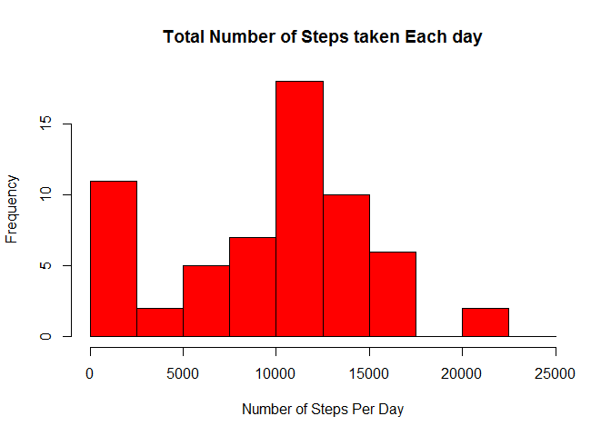
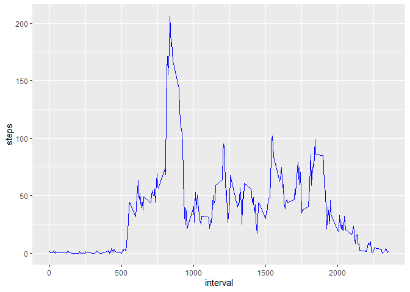
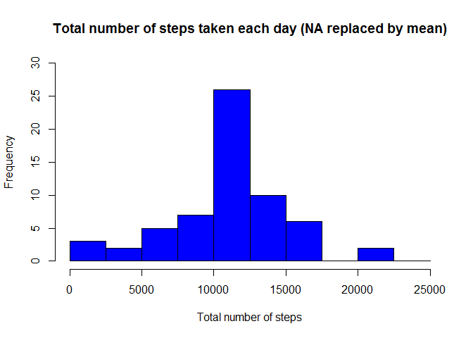
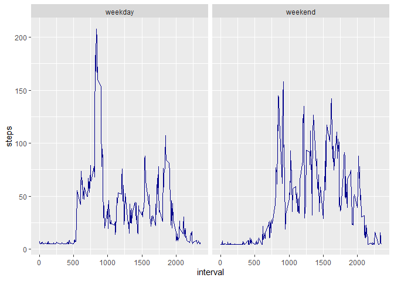

```
#Title: "Reproducible Research: Peer Assessment 1"
##output: Results of Asignment in RD and HTML 
###  html_document:
#Author- Prahlad
    keep_md= true
```

```r
library(ggplot2)
library(scales)
library(Hmisc)
```

```
## Warning: package 'Hmisc' was built under R version 3.6.1
```

```
## Loading required package: lattice
```

```
## Loading required package: survival
```

```
## Loading required package: Formula
```

```
## 
## Attaching package: 'Hmisc'
```

```
## The following objects are masked from 'package:base':
## 
##     format.pval, units
```

## Loading and preprocessing the data
###1. Load the data(i.e. read.csv())

```r
setwd("C:/Users/Prahlad/Documents/COURSERA/REPRODUCIBLE RESEARCH/RepData_PeerAssessment1")
unzip("activity.zip")
```
## Pre Procesing the data - change the date format into date

```r
data<-read.csv("activity.csv")
data$date<-as.Date(data$date)
```
##Histogram  of the total steps taken everyday (without NA Values)
### calculation done by day and sum
###Histogram is shown below

```r
steps_per_day<-aggregate(data$steps, by= list(data$date), FUN=sum, na.rm=TRUE)

hist(steps_per_day$x, col="red", breaks=seq(from=0, to=25000, by=2500), main="Total Number of Steps taken Each day", xlab="Number of Steps Per Day")
```

<!-- -->

## mean and median of total number of steps taken per day.


```r
mean(steps_per_day$x)
```

```
## [1] 9354.23
```

```r
median(steps_per_day$x)
```

```
## [1] 10395
```

## Average daily activity pattern
###Time Series Plot of Average no of steps taken (daily activity - steps)


```r
avg_steps<-aggregate(data$steps,by=list(data$interval),FUN=mean,na.rm=TRUE)

colnames(avg_steps)<-c("interval","steps")

ggplot(aes(x= interval,y=steps),data=avg_steps)+geom_line(color="blue")
```

<!-- -->

## Interval with the maximum number of steps


```r
avg_steps[avg_steps$steps==max(avg_steps$steps),1]
```

```
## [1] 835
```

## Imputing missing values - Total no of rows with NAs


```r
sum(is.na(data$steps))
```

```
## [1] 2304
```

###Replace NA values with some value say the mean of the steps in the intervals


```r
data$steps[is.na(data$steps)]<-mean(data$steps,na.rm=TRUE)
```
#Histogram with Repaced NA values

```r
sum_steps<-aggregate(data$steps,by=list(data$date),FUN=sum,na.rm=TRUE) 
hist(sum_steps$x, 
      breaks=seq(from=0, to=25000, by=2500),
      col="blue", 
      xlab="Total number of steps", 
      ylim=c(0, 30), 
      main="Total number of steps taken each day (NA replaced by mean)")
```

<!-- -->

###Mean and median number of steps taken each day after replacing NA values with mean


```r
mean(sum_steps$x)
```

```
## [1] 10766.19
```

```r
median(sum_steps$x)
```

```
## [1] 10766.19
```

## Differences in activity patterns between weekdays & weekends


```r
data$days=tolower(weekdays(data$date)) # date to weekdays

#days into weekend / weekdays

data$day_type<-ifelse(data$days=="saturday"|data$days=="sunday","weekend","weekday")

# mean steps taken on weekend or weekday in 5 min intervals

avg_steps<-aggregate(data$steps,by=list(data$interval,data$day_type),FUN=mean,na.rm=TRUE)

colnames(avg_steps)<-c("interval","day_type","steps")

# panel plot between average steps and interval seperated by week day week end 

ggplot(aes(x=interval,y=steps),data=avg_steps)+geom_line(color="darkblue")+facet_wrap(~avg_steps$day_type)
```

<!-- -->
